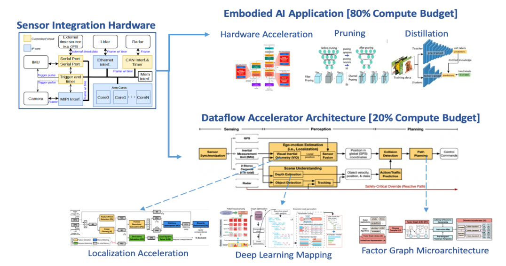
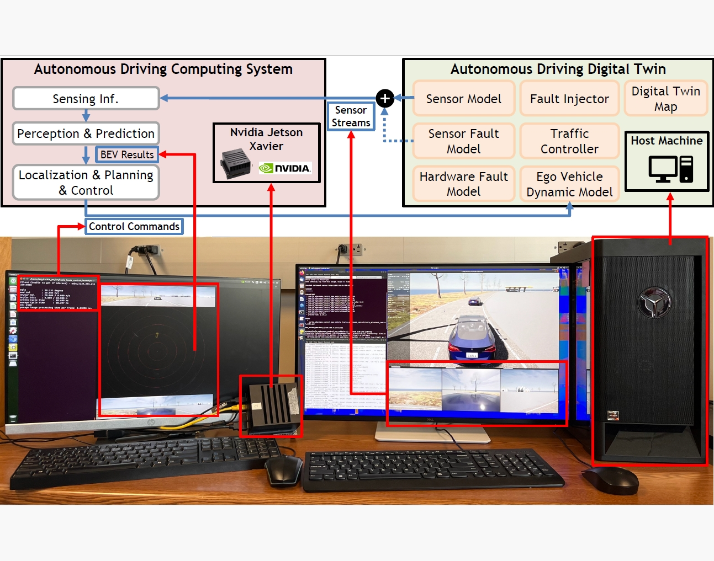

# AIRSTONE: Enabling Power and Cost Efficient Robotic Computing Chips Through Hardware Accelerator

Embodied AI (EAI) augmented robotics holds immense promise for reshaping future society and industry. However, it presents significant computing challenges, particularly in enabling efficient on-robot processing. Achieving human-comparable intelligence in robots necessitates sophisticated AI software for understanding, reasoning, and planning, resulting in a substantial paradigm shift from traditional robotic computing. This shift demands innovative hardware architectures to facilitate efficient on-robot computation.

On-robot computing systems must execute the EAI software pipeline while adhering to real-time, power, and cost constraints dictated by the application. The stringent constraints, combined with high computational demands, pose significant challenges for the underlying hardware architecture. For example, real-time reactive robot controls typically require the processing of tens of images per second, followed by complex computations to generate hundreds of control commands per second. Meanwhile, a typical EAI system, incorporating large AI models and traditional robotic tasks, demands trillions of operations per second.

Airstone project aims to tackle with the on-robot computing challenge. Its ultimate mission is to enable the real-time execution of EAI software on embedded chips, a key factor for the large-scale deployment of EAI robots. Based on our researches and observations over the past few years, we take an accelerator design approach tailored for robotic workloads to tackle the challenge of efficient EAI computing.

For computational resource allocation at a very high level, based on characterizing traditional robotic computing pipelines and profiling the computational requirements of EAI models, we have established a compute resource allocation for embedded EAI systems. Our compute budget partition is illustrated in Figure 1, 80% of the compute resources are allocated to EAI models, and the remaining 20% are assigned to classic robotic computing tasks, including localization, path planning, and control.

Figure 1: 80% compute budget for EAI workload and 20% compute budget for robotic computing.

For architectural level design, we believe dataflow architecture plus accelerator is more suitable for robotic computing, as shown in Figure 1. First, robotic computing pipelines exhibit a dataflow computing pattern. Information from the physical world is sequentially captured and processed by sensing, perception, decision, and control models [1]. Second, the end-to-end latency of the pipeline is the most critical factor, affecting safety and control precision of a robot. Accelerators play a crucial role in robotic computing, offering advantages in power, cost, and latency.

In addition to innovations in system architecture, the Airstone project aims to introduce new development tools and methodologies to accelerate the development of embodied AI systems. This initiative is driven by the fact that current robot system development remains heavily reliant on physical testing and manual debugging, leading to significant inefficiencies in time and cost. To achieve a substantial increase in productivity, a transition toward simulation-driven, design automation methodologies for embodied AI system development is essential. This need motivates the development of the Digital Twin-Based Design Automation Paradigm [2-3]. The Airstone project will incorporate our previous work on ADDT, a digital twin system for autonomous driving systems, which enables hardware-in-the-loop (HIL) development and the verification of safety and performance. The following video demonstrates the HIL setup and fault injection capabilities. We plan to extend ADDT into a digital twin-based platform for the broader development of embodied AI systems.

Figure 2: The HIL setup of autonomous driving digital twin.

Over the past few years, we have conducted research on hardware accelerators for robotic computing, resulting in a book [4] and numerous research papers [5-12]. Our book [1] provides a holistic survey of robotic software stacks and their FPGA-based accelerators for efficient robot computing. Our research papers have implemented several widely used and computationally expensive algorithmic building blocks, termed "robotic operators," in hardware [5-12]. These accelerators have demonstrated surprisingly significant advantages over CPU baselines. For example, one of our works uses FPGAs to accelerate factor graphs, optimization algorithms commonly used in localization, planning, and control, boosting performance by 40 to 60 times compared to an embedded CPU.

To accelerate the development of accelerator-empowered (especially FPGA or ASIC-based) robotic computing systems, we have decided to open-source our FPGA-based accelerator designs, seeking collaboration with the developer community and companies. 

We are packaging our accelerator designs into the AIRSTONE project. Through AIRSTONE, we aim to: 1) develop hardware IP for traditional robotic computing that can be seamlessly integrated into SoC chips to boost performance and reduce the cost of on-robot computing systems; and 2) develop instruction sets for robotic computing that can augment embedded CPUs' instruction sets.

In the AIRSTONE project, we will continually open-source accelerator designs for EAI robots. In its first phase, we are primarily open-sourcing accelerator designs from our previous papers, focusing on localization, path planning, and controls and HIL digital twin simulator:
1. [ORB feature extraction](https://github.com/airs-cuhk/airstone/tree/main/orb).
2. [Factor graph based optimizers for localization, path planning and control](https://github.com/airs-cuhk/airstone/tree/main/factor_graph).
3. [Autonomous driving digital twin simulator](https://github.com/airs-cuhk/airstone/tree/main/ADDT).

Reference: 
1. "Building the computing system for autonomous micromobility vehicles: Design constraints and architectural optimizations." 2020 53rd Annual IEEE/ACM International Symposium on Microarchitecture (MICRO). IEEE, 2020.
2. “Autonomous Vehicles Digital Twin: A Practical Paradigm for Autonomous Driving System Development,” Computer, vol. 55, no. 9, pp. 26–34, 2022.
3. “Autonomous Driving Digital Twin Empowered Design Automation: An Industry Perspective,” in 2023 60th ACM/IEEE Design Automation Conference (DAC), 2023, pp. 1–4.
4. “Robotic computing on fpgas.” Springer International Publishing, 2021.
5. "Orianna: An accelerator generation framework for optimization-based robotic applications." Proceedings of the 29th ACM International Conference on Architectural Support for Programming Languages and Operating Systems, Volume 2. 2024.
6. "FPGA-based ORB feature extraction for real-time visual SLAM." 2017 International Conference on Field Programmable Technology (ICFPT). IEEE, 2017.
7. "Accelerating Autonomous Path Planning on FPGAs with Sparsity-Aware HW/SW Co-Optimizations." Proceedings of the 2024 ACM/SIGDA International Symposium on Field Programmable Gate Arrays. 2024.
8. "Archytas: A framework for synthesizing and dynamically optimizing accelerators for robotic localization." MICRO-54: 54th Annual IEEE/ACM International Symposium on Microarchitecture. 2021.
9. "Eudoxus: Characterizing and accelerating localization in autonomous machines industry track paper." 2021 IEEE International Symposium on High-Performance Computer Architecture (HPCA). IEEE, 2021.
10. "π-BA: Bundle Adjustment Hardware Accelerator Based on Distribution of 3D-Point Observations." IEEE transactions on computers 69.7 (2020): 1083-1095.
11. "Blitzcrank: Factor graph accelerator for motion planning." 2023 60th ACM/IEEE Design Automation Conference (DAC). IEEE, 2023.
12. "Factor graph accelerator for lidar-inertial odometry." Proceedings of the 41st IEEE/ACM International Conference on Computer-Aided Design. 2022.

